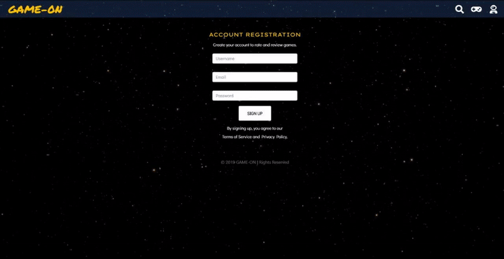
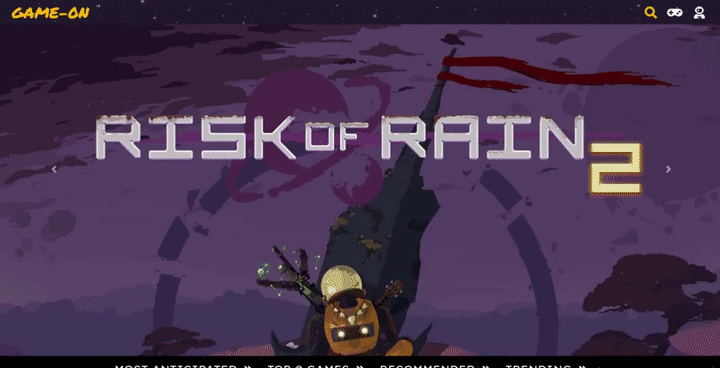

<br>
GAME-ON is a web app that allows users to discover, rate and review games. Users are able to register and log into their account, modify ratings and delete their game reviews. All data on games are from IGDB's API.

## C O N T E N T S
░ [Technologies](#technologies)<br>
░ [Features](#features)<br>
░ [Installation](#install)<br>
░ [Version 2.0](#version)<br>
░ [About Me](#aboutme)<br>

## <a name="technologies"></a>⫸ T E C H N O L O G I E S ⫷
**BACKEND ⋯** 🐍 Python , Flask, PostgreSQL, SQLAlchemy <br>
**FRONTEND ⋯** JavaScript, AJAX, jQUERY, Jinja2, Boostrap, HTML5, CSS3 <br>
**API ⋯** IGDB <br>

## <a name="features"></a> ⫸ F E A T U R E S ⫷
### ≡ Discover: Anticipated, Top 10, Recommended & Trending Games ≡ <br>

<br>

<br>
### ≡ Registration & Login ≡ <br>

<br>
### ≡ Search ≡ <br>

### Rate & Review.  <br>


## <a name="install"></a>⫸ I N S T A L L A T I O N ⫷
### To run GAME-ON: <br/>
**Clone or fork this repo**:
```
$ git clone https://github.com/xerilius/GAME-ON.git
```
**Create and  activate a virtual environment inside the GAME-ON directory:**
```
$ virtualenv env
$ source env/bin/activate
```
**Install the dependencies:**
```
$ pip install -r requirements.txt
```
**Sign-up to use [IGDB's API](https://api.igdb.com/signup). <br>
Save your API key :key: in a file <kbd>secrets.sh</kbd> with this format:**
```
export SECRET_KEY = "PUT_YOUR_KEY_HERE"
export IGDB_API_KEY = "PUT_YOUR_KEY_HERE"
```
**Source your keys from <kbd>secrets.sh</kbd>:**
```
$ source secrets.sh
```
**Set up the database:**
```
$ createdb gameon
```
**Seed data into database:**
```
$ python3 seed.py
```
**Run the app:**
```
$ python3 server.py
```
**In your web browser, type in `localhost:5000` in the URL bar to access GAME-ON.**

## <a name="version"></a>⫸ V E R S I O N - 2.0 ⫷
* Edit reviews
* Favorite games
* Newsfeed
* Videos
* Chat


## <a name="aboutme"></a> ⫸ A B O U T - M E ⫷
Grace Chung is an avid gamer and a software engineer. <br>
To learn more about me, check out my [LinkedIn](http://www.linkedin.com/in/chung-grace)!
